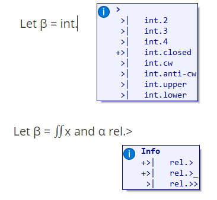

# UnicodeInput

This is a script that lets you input Unicode characters using ordinary text commands. It was written to make writing Unicode math a lot easier. It's written in AHK. Some of its features:

1. You don't get headaches from having to memorize convoluted keyboard layouts.
2. You don't suffer from wrist injuries while trying to hold down 13 modifier keys at once.
3. Compatible with almost every text program a sane person could use.
4. You don't lose your game of Overwatch because you accidentally told Tracer to solve a math problem.
5. You don't have to rewrite the whole thing if you want to add a few of your favorite math operators.

The script works using commands, in the form `a.b.c`. For example, the command `integral.2` is mapped to `∬`, a double integral. 

Other examples include:

* `integral.closed.2` maps to `∯`
* `set.in` maps to `∈`
* `set.sub` maps to `⊂`

You can change the command bindings to type any Unicode character you desire.

### Installation

Download the latest release from the Releases section. Run it.

If you want to execute the script itself, see *development* below.

## Usage

To type a command, press **Alt + `** (the grave accent, usually placed at the start of the number row on your keyboard).

This will bring up a tooltip that updates automatically when you start typing more characters.



The list of characters is split into namespaces, with the `.` separating each pair of namespaces. Here are some examples:

```
int  integrals
rel  relations
gr   greek
```

Symbols can also have names with ASCII symbols you can easily type on your keyboard, such as:

`rel.>>` becoming `≫` 

To execute a command and turn it into a Unicode character, press either Space or Enter. Pressing navigation characters such as Left, Down, WinKey, or using the mouse buttons will cancel the command.

## Customization
The mappings used by the program are taken from a `Layout.json` file, which maps every command (in its full form, e.g. `integral.2`) to a symbol. The file is user-editable, and you can add your own mappings freely.

### Development

Clone/fork this repo.

This script has some prerequisites that aren't included in the repo. To download them, download the following script file:

https://github.com/GregRos/dumb.sh/blob/master/dumb.sh

And run it in the script's folder. This will pull the dependencies and generate a Lib folder. Then you can run the script.